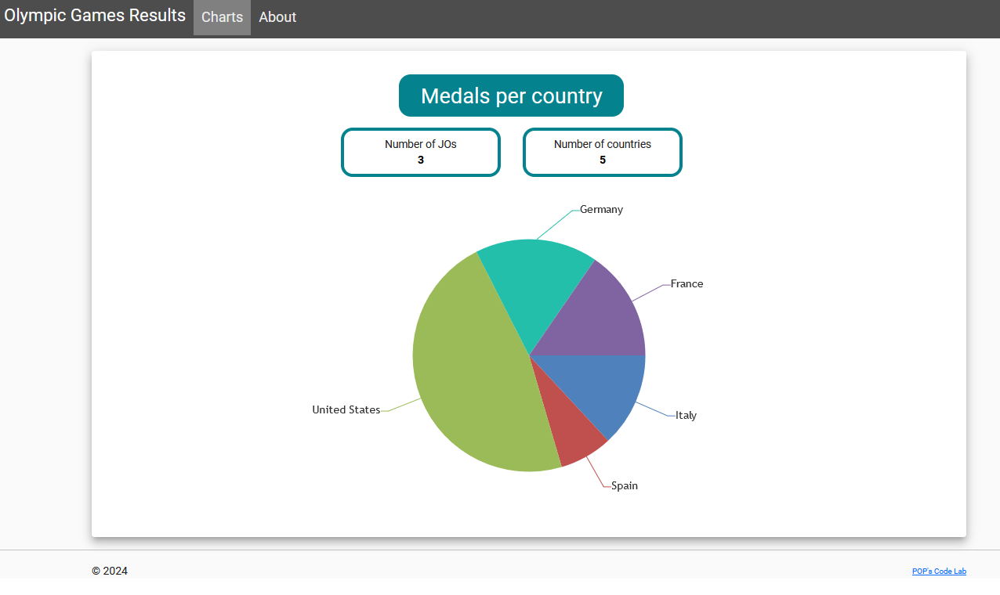
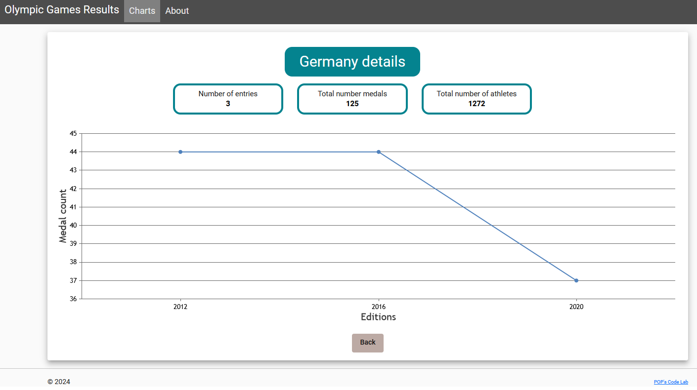
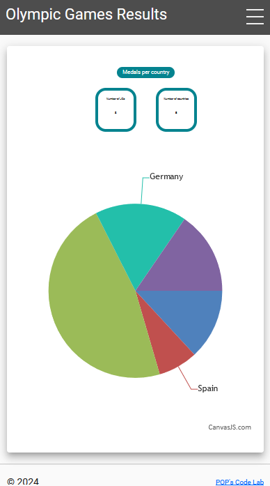
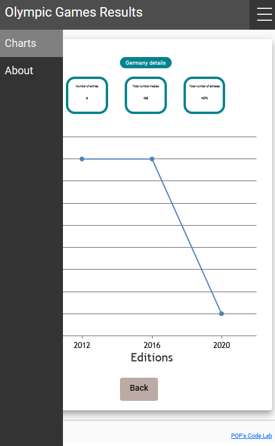

# Olympic Games
## Table of contents

- Description and goals
- Installation
- Development server
- Build
- Technologies
- Compodoc
- Authors
- Screenshots

## Description and goals

Olympic Games is the OpenClassroom project 2 : Développer me front-end en utilisant Angular.

This application provides a dashboard displaying information from previous Olympic Games (number of medals by country, etc.).

The main goals of this project are :

- Use services to make HTTP calls.
- Use RxJS and observables.
- Unsubscribe observables.
- Minimize the use of type "any".

## Installation

This project was generated with [Angular CLI](https://github.com/angular/angular-cli) version 14.1.3.

Don't forget to install your node_modules before starting (`npm install`).

## Development server

Run `ng serve` for a dev server. Navigate to `http://localhost:4200/`. The application will automatically reload if you change any of the source files.

## Build

Run `ng build` to build the project. The build artifacts will be stored in the `dist/` directory.

## Technologies

<table style="border: none">
<tr style="border: none">
  <td style="border: none">HTML5</td><td style="border: none">
  </td>
</tr>
<tr style="border: none">
  <td style="border: none">TypeScript</td><td style="border: none">
  </td>
</tr>
<tr style="border: none">
  <td style="border: none">JavaScript</td><td style="border: none">
  </td>
</tr>
<tr style="border: none">
  <td style="border: none">CSS3</td><td style="border: none">
  </td>
</tr>
<tr style="border: none">
  <td style="border: none">Bootstrap 4.6.0</td>
  <td style="border: none"></td>  
</tr>
<tr style="border: none">
  <td style="border: none">Font Awesome 6.5.2</td>
  <td style="border: none"></td>
 </tr>
<tr style="border: none"> 
  <td style="border: none">Angular 14.1.3</td>
  <td style="border: none"></td>
</tr>
<tr style="border: none"> 
  <td style="border: none">CanvasJS Chart  3.7.45</td>
  <td style="border: none"></td>
</tr>
<tr style="border: none">  
  <td style="border: none">Compodoc 1.1.23</td>
  <td style="border: none"></td>
</tr>
<tr style="border: none"> 
  <td style="border: none">Angular Material 14.1.0</td>
  <td style="border: none"></td>
</tr>
</table>

## Compodoc

To generate the documentation, if compodoc is not installed, follow the instructions bellow :

instal compodoc : `npm install @compodoc/compodoc`

Once installed :
- To generate the documentation run the command : `npm run compodoc`
- To Serve it on http://127.0.0.1:8080  : `npm run compodoc:serve`

## Authors

POP's Code Lab

## Screenshots

